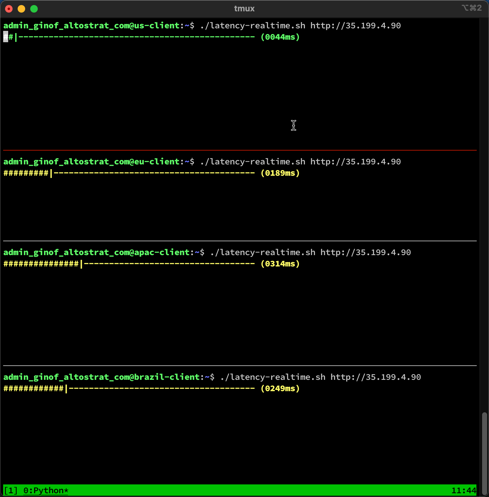
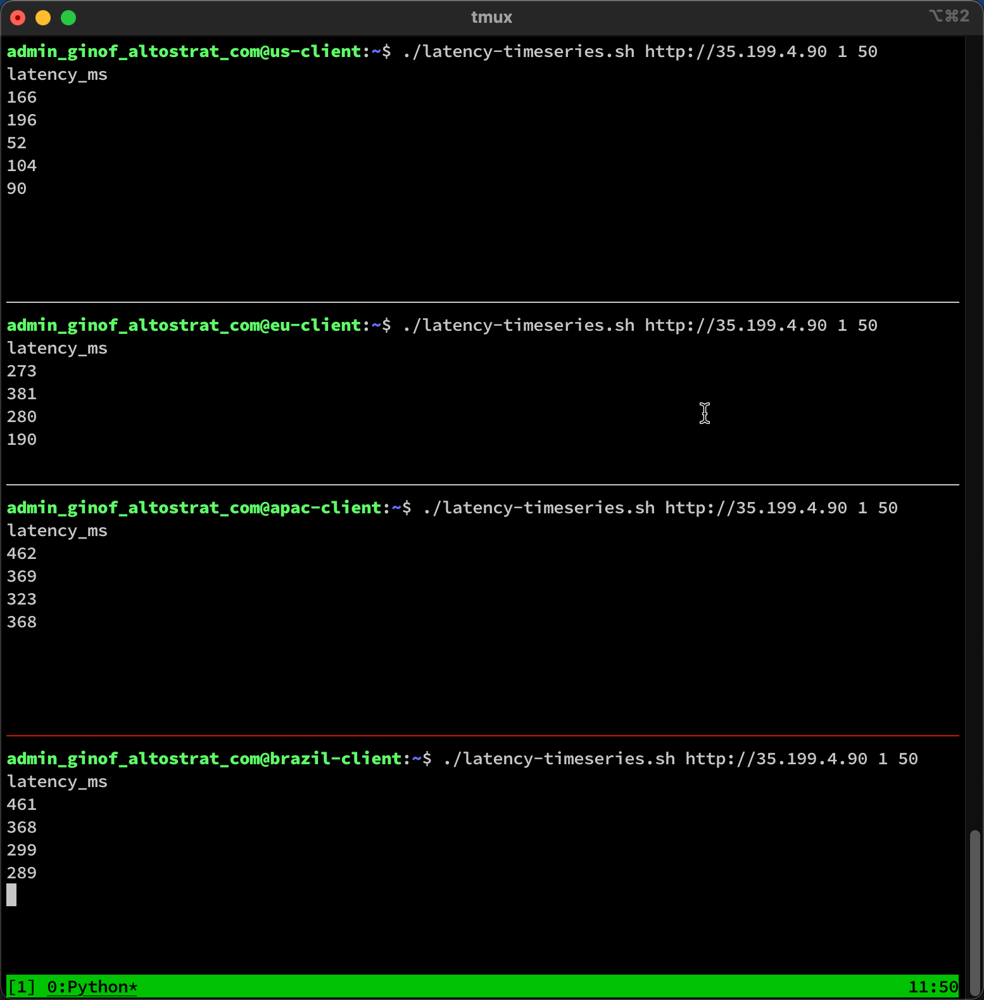

# Latency Meter
## Introduction
The latency meter tool will continuously curl to an HTTP endpoint and show the measure roundtrip time (or other metrics as desired).

## Description
There are two scripts provided:
- **`latency-realtime.sh`**: This script will continuous ping the URL provided (at the desired frequency) and the measured roundtrip time is continuously output as a since coloured meter (see below).
- **`latency-timeseries.sh`**: This script will continuous ping the URL provided (at the desired frequency) and the measured roundtrip time is continuously output as a single column CSV file to stdout (you can redirect it into a file if you choose).

In addition, there is a helper script provided:
- **`open-tmux-panes.sh`**: You can modify this script to help to start a multi-pane tmux session logged into various ssh servers. From there you can run the latency meter on each one synchronous and inspect the differences (see screenshots below).
    - **NOTE:** You need to install [tmux](https://github.com/tmux/tmux) and [xpanes](https://github.com/greymd/tmux-xpanes)

## Usage
- `latency-realtime.sh [URL] [FREQUENCY]`
- `latency-timeseries.sh [URL] [FREQUENCY] [COUNT]`

## Defaults
- **URL**: http://www.google.com
- **FREQUENCY**: 1 (seconds)
- **COUNT**: 50 (iterations)

## Examples
#### `latency-realtime.sh`

#### `latency-timeseries.sh`

## License
This repository is licensed under the Apache v2.0 license. More information can be found [here](./LICENSE).
